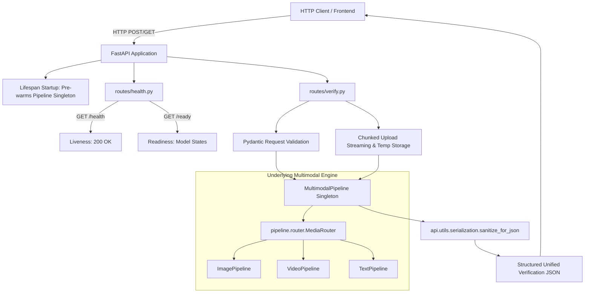

# FastAPI Backend & Service Layer Documentation

## Executive Summary
This document provides a comprehensive overview of the FastAPI REST API service layer developed for the **Digital Media Verification** system. The service layer exposes the underlying multimodal verification engine—including deepfake detection (`EfficientNet-B4`), propaganda classification (`RoBERTa-base`), hate-speech identification (`BERT-base-uncased`), optical character recognition (`EasyOCR`), automatic speech recognition (`openai/whisper-base`), explainability (Grad-CAM, Token Attribution), and uncertainty quantification (MC Dropout $T=20$)—through modular, validated HTTP endpoints.

---

## 1. API Architecture

The FastAPI service is designed as a **thin service layer** that sits directly between external clients and the pre-existing `MultimodalPipeline` orchestrator without duplicating business logic, model weights, or inference algorithms.



---

## 2. Endpoint Catalog

| Method | Endpoint | Description | Content-Type | Request Body / Params | Response Model |
| :--- | :--- | :--- | :--- | :--- | :--- |
| `GET` | `/health` | Liveness check (does not reload weights) | `application/json` | None | `HealthResponse` |
| `GET` | `/ready` | Readiness check (verifies pipeline components) | `application/json` | None | `ReadyResponse` |
| `POST` | `/verify/text` | Verifies text for propaganda and hate-speech | `application/json` | `{"text": "..."}` | Unified Verification JSON |
| `POST` | `/verify/image` | Verifies still image (deepfake + OCR) | `multipart/form-data` | `file`, `caption` (optional) | Unified Verification JSON |
| `POST` | `/verify/video` | Verifies video (deepfake + OCR + ASR) | `multipart/form-data` | `file`, `caption`, `async_mode`, `sample_fps`, `max_frames` | Direct JSON or `AsyncJobResponse` |
| `GET` | `/verify/status/{job_id}` | Checks status of background video analysis | `application/json` | `job_id` path param | `JobStatusResponse` |
| `POST` | `/verify/multimodal` | Unified media (image/video) + caption routing | `multipart/form-data` | `file` (optional), `text` (optional) | Unified Verification JSON |

---

## 3. Request Formats & Validation

All incoming requests are strictly validated using Pydantic models and FastAPI parameter bindings:

### A. Text Verification (`POST /verify/text`)
- **Schema**:
  ```json
  {
    "text": "The election process is rigged according to internal whistleblowers."
  }
  ```
- **Constraints**:
  - `min_length = 1`
  - `max_length = 10000`
  - Stripped non-empty validator (`ValueError` raised if whitespace-only $\implies$ `HTTP 422`).

### B. Image Verification (`POST /verify/image`)
- **Form Data**:
  - `file`: `UploadFile` (Required)
  - `caption`: `str` (Optional)
- **Validation**:
  - Supported extensions: `.jpg`, `.jpeg`, `.png`, `.bmp`, `.webp`, `.tiff`.
  - Max size: `15 MB` (`MAX_IMAGE_SIZE_BYTES`).
  - Empty files (0 bytes) rejected with `HTTP 400`.

### C. Video Verification (`POST /verify/video`)
- **Form Data**:
  - `file`: `UploadFile` (Required)
  - `caption`: `str` (Optional)
  - `async_mode`: `bool` (Optional, default: `false`)
  - `sample_fps`: `float` (Optional, default: `1.0`)
  - `max_frames`: `int` (Optional, default: `16`)
- **Validation**:
  - Supported extensions: `.mp4`, `.avi`, `.mov`, `.mkv`, `.webm`, `.m4v`.
  - Max size: `100 MB` (`MAX_VIDEO_SIZE_BYTES`).

---

## 4. Response Schema & JSON Sanitization

The API preserves the project's **unified multimodal verification schema** without creating competing response models:

```json
{
  "input": {
    "input_type": "image|video|text",
    "filename": "...",
    "size_bytes": 1048576,
    "status": "VALID|PROCESSED"
  },
  "visual": {
    "status": "SUCCESS|NO_FACE_DETECTED|NOT_APPLICABLE",
    "face_detected": true,
    "prediction": "real|fake|null",
    "confidence": 0.8842,
    "explanation": {
      "heatmap_shape": [7, 7],
      "disclaimer": "Grad-CAM and token attribution are post-hoc explanatory signals..."
    },
    "uncertainty": {
      "mean_probability": [0.12, 0.88],
      "variance": [0.0001, 0.0001],
      "entropy": 0.4521,
      "mc_samples": 20
    }
  },
  "text": {
    "sources": ["OCR", "ASR", "USER_TEXT"],
    "segments": [...],
    "combined_text": "...",
    "text_status": "AVAILABLE|NO_TEXT_AVAILABLE"
  },
  "propaganda": {
    "status": "SUCCESS|NO_TEXT_AVAILABLE|NOT_APPLICABLE",
    "prediction": "Loaded_Language",
    "confidence": 0.7612,
    "explanation": {"top_tokens": [...], "disclaimer": "..."},
    "uncertainty": {...}
  },
  "hate_speech": {
    "status": "SUCCESS|NO_TEXT_AVAILABLE|NOT_APPLICABLE",
    "prediction": "normal",
    "confidence": 0.8241,
    "explanation": {"top_tokens": [...], "disclaimer": "..."},
    "uncertainty": {...}
  },
  "uncertainty": {
    "deepfake": {...},
    "propaganda": {...},
    "hate_speech": {...}
  },
  "governance": {
    "review_required": true,
    "decision_status": "REVIEW_RECOMMENDED|CONFIDENT_PREDICTION",
    "review_trigger_component": "propaganda",
    "disclaimer": "Human review is a responsible AI safeguard triggered by predictive uncertainty."
  },
  "audit": {
    "timestamp": "2026-09-10T10:42:00Z",
    "execution_time_seconds": 2.45,
    "models_executed": ["EfficientNet-B4", "RoBERTa", "BERT"],
    "checkpoint_versions": {...},
    "errors": []
  }
}
```

### Recursive Numeric Sanitization (`api/utils/serialization.py`)
To prevent JSON serialization crashes (`TypeError: Object of type float32 is not JSON serializable`), all payloads pass through `sanitize_for_json()`:
- Converts `np.bool_` and Python `bool` strictly to JSON boolean (`true`/`false`), preventing bools from being coerced to `1`/`0`.
- Converts `np.floating` to standard float, replacing `NaN`/`Inf` with `None`.
- Converts `np.integer` to standard int.
- Converts `np.ndarray` and `torch.Tensor` to nested Python lists.

---

## 5. Upload Handling & Temporary File Lifecycle

To prevent Memory Exhaustion (OOM):
1. **Chunked Streaming**: Uploads are read in 64 KB chunks (`CHUNK_SIZE = 64 * 1024`) from `UploadFile.read()` directly into a temporary file on disk (`tempfile.NamedTemporaryFile`).
2. **Hard Size Limit Enforcement**: If total bytes written exceed `MAX_IMAGE_SIZE_BYTES` (15 MB) or `MAX_VIDEO_SIZE_BYTES` (100 MB), streaming aborts immediately, the file is unlinked, and `HTTP 413` is returned.
3. **Deterministic Cleanup Guarantee**: All processing endpoints wrap pipeline calls in `try ... finally: file_utils.cleanup_temp_file(temp_path)`. Temporary media files are unlinked regardless of whether inference succeeds or fails.

---

## 6. Model Lifecycle & Performance Architecture

- **Pre-warming on Startup**: `FastAPI.lifespan` triggers `api.dependencies.pipeline_dep.init_pipeline(device="cpu")` once when the server boots.
- **Shared Singleton**: The single `MultimodalPipeline` instance manages sub-pipeline detectors (`DeepfakeDetector`, `PropagandaDetector`, `HateSpeechDetector`, `EasyOCRReader`, `WhisperASR`).
- **Zero Reload Overhead**: Subsequent requests to `/verify/*` inject the pre-warmed instance via FastAPI's `Depends(get_pipeline)` without reloading weights or re-allocating memory.
- **Whisper ASR Integration**: Configured with `openai/whisper-base` (~290 MB weights) with container audio stream pre-probing to bypass speech models for silent videos.

---

## 7. Asynchronous Video Processing (Background Tasks)

For long-form or compute-intensive video analyses:
1. `POST /verify/video?async_mode=true` returns immediately with an initial tracking payload:
   ```json
   {
     "job_id": "c1f7a0b2-9a3d-4e2b-8a3e-7a1b9c3d4e5f",
     "status": "QUEUED",
     "message": "Video verification job successfully queued for background processing.",
     "poll_url": "/verify/status/c1f7a0b2-9a3d-4e2b-8a3e-7a1b9c3d4e5f"
   }
   ```
2. FastAPI's `BackgroundTasks` processes the video asynchronously.
3. Clients query `GET /verify/status/{job_id}` to retrieve progress:
   - Possible states: `QUEUED` $\rightarrow$ `PROCESSING` $\rightarrow$ `COMPLETED` / `FAILED`.
   - On completion, `result` contains the full unified verification payload.

> [!NOTE]
> **MVP Limitation**: The background task runner utilizes an in-memory dictionary (`job_store`). Active and completed jobs will not survive process restarts or multi-worker deployments without an external database/broker (e.g., Redis/Celery in future stages).

---

## 8. Security & Responsible AI Safeguards

1. **Filename Sanitization**: Uploaded filenames are stripped of non-alphanumeric characters (except `_.-`) using regex `re.sub(r'[^a-zA-Z0-9_.-]', '_', basename)` to prevent directory traversal (`../`).
2. **File Execution Ban**: Uploaded media are never executed as scripts or shell commands.
3. **No Unrestricted Storage**: Media is strictly processed in ephemeral scratch storage and immediately deleted.
4. **Stack Trace Isolation**: The global exception handler intercepts unhandled server errors (500) and returns sanitized messages without leaking internal tracebacks.
5. **Decision Support Mandate**: Predictions are accompanied by epistemic uncertainty ($T=20$), post-hoc explainability disclaimers, and human review flags (`REVIEW_RECOMMENDED`).

---

## 9. Running Instructions

### Local Development Server
```bash
# Run with uvicorn on port 8000
python -m uvicorn api.main:app --host 0.0.0.0 --port 8000 --reload
```

### Interactive Documentation
- **Swagger UI (OpenAPI)**: `http://localhost:8000/docs`
- **ReDoc**: `http://localhost:8000/redoc`
- **OpenAPI JSON**: `http://localhost:8000/openapi.json`

---

## 10. Automated Test Results

Executed via `python -m pytest tests/test_api.py -v`:

```
============================= test session starts =============================
platform win32 -- Python 3.14.2, pytest-9.1.1, pluggy-1.6.0
rootdir: C:\Users\Swaraj Shedge\Desktop\College\TY\ERA\Digital Media Verification\Digital-Media-Verification
collected 19 items

tests/test_api.py::TestHealthAndReadiness::test_health_endpoint PASSED   [  5%]
tests/test_api.py::TestHealthAndReadiness::test_ready_endpoint PASSED    [ 10%]
tests/test_api.py::TestTextVerificationEndpoint::test_valid_text_verification PASSED [ 15%]
tests/test_api.py::TestTextVerificationEndpoint::test_empty_text_rejected PASSED [ 21%]
tests/test_api.py::TestTextVerificationEndpoint::test_missing_text_field PASSED [ 26%]
tests/test_api.py::TestImageVerificationEndpoint::test_valid_image_with_face PASSED [ 31%]
tests/test_api.py::TestImageVerificationEndpoint::test_image_without_face PASSED [ 36%]
tests/test_api.py::TestImageVerificationEndpoint::test_invalid_image_extension PASSED [ 42%]
tests/test_api.py::TestImageVerificationEndpoint::test_empty_image_file PASSED [ 47%]
tests/test_api.py::TestVideoVerificationEndpoint::test_valid_video_with_audio_sync PASSED [ 52%]
tests/test_api.py::TestVideoVerificationEndpoint::test_silent_video_sync PASSED [ 57%]
tests/test_api.py::TestVideoVerificationEndpoint::test_valid_video_async_mode PASSED [ 63%]
tests/test_api.py::TestVideoVerificationEndpoint::test_invalid_job_id_returns_404 PASSED [ 68%]
tests/test_api.py::TestVideoVerificationEndpoint::test_invalid_video_extension PASSED [ 73%]
tests/test_api.py::TestMultimodalEndpoint::test_multimodal_image_and_text PASSED [ 78%]
tests/test_api.py::TestMultimodalEndpoint::test_multimodal_text_only PASSED [ 84%]
tests/test_api.py::TestMultimodalEndpoint::test_multimodal_no_input_rejected PASSED [ 89%]
tests/test_api.py::TestErrorResponsesAndLimits::test_structured_error_response_format PASSED [ 94%]
tests/test_api.py::TestErrorResponsesAndLimits::test_oversized_image_upload_rejected PASSED [100%]

======================= 19 passed, 9 warnings in 34.75s =======================
```

### Overall Regression Test Summary
- **API Test Suite** (`tests/test_api.py`): **19 / 19 passed**
- **Multimodal Pipeline Test Suite** (`tests/test_multimodal_pipeline.py`): **11 / 11 passed**
- **Explainability & UQ Test Suite** (`tests/test_explainability_uncertainty.py`): **11 / 11 passed**
- **Grand Total**: **41 / 41 passed (100% pass rate)**.
