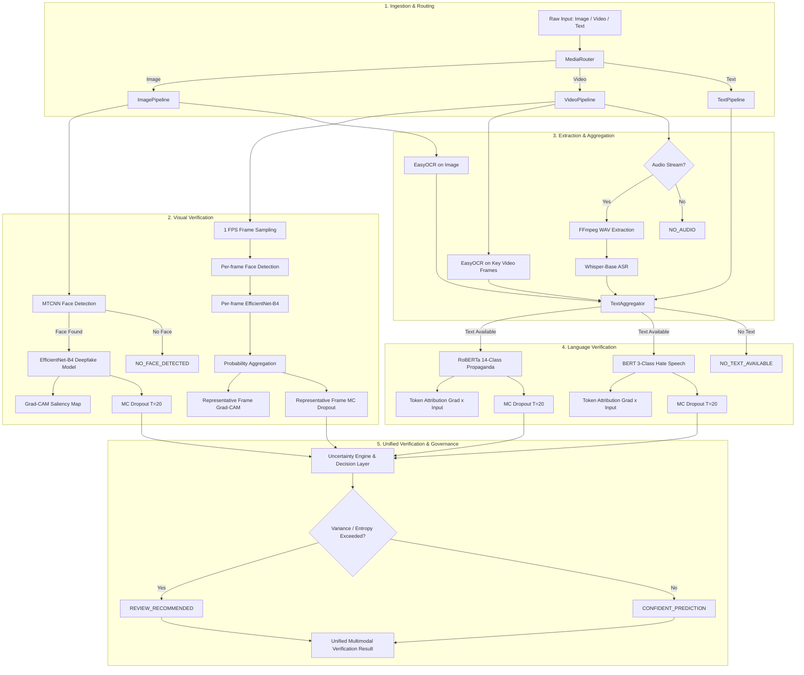

# Multimodal Ingestion & Pipeline Orchestration Report

## Executive Summary
This report documents the architectural design, algorithmic workflows, integration mechanisms, and verification benchmarks for the core end-to-end **Multimodal Verification Pipeline** of the Digital Media Verification system.

The pipeline ingests heterogeneous media types—**Image**, **Video**, and **Text**—intelligently routing inputs through only the relevant computer vision, speech recognition, optical character recognition (OCR), and natural language processing (NLP) detectors. All detectors interface directly with the Explainable AI (XAI) engine (Grad-CAM, Token Attribution) and the Monte Carlo Dropout Uncertainty Engine ($T=20$), synthesizing findings into a unified, audit-traceable schema governed by human-in-the-loop safeguards.

---

## 1. System Architecture & Flowchart

The system follows a modular, decoupled pipeline architecture where detection and extraction components are instantiated once and shared across sub-pipelines to eliminate redundant GPU/CPU memory allocations.



---

## 2. Media Ingestion & Router (`pipeline/router.py`)

The ingestion layer safely inspects the input type without loading large video files into memory:
1. **In-Memory Objects**: Recognizes `PIL.Image.Image` and `numpy.ndarray` RGB matrices without serialization overhead.
2. **File Path Inspection**: Reads extension and metadata (`os.path.getsize`, `os.path.basename`) for supported formats:
   - Images: `.jpg`, `.jpeg`, `.png`, `.bmp`, `.webp`, `.tiff`
   - Videos: `.mp4`, `.avi`, `.mov`, `.mkv`, `.webm`, `.m4v`
3. **Raw Text Detection**: Non-file string inputs are identified as direct textual content.
4. **Structured Metadata Output**:
   ```json
   {
       "input_type": "image|video|text",
       "filename": "...",
       "size_bytes": 1048576,
       "status": "VALID"
   }
   ```

---

## 3. Image Verification Flow (`pipeline/image_pipeline.py`)

For still images:
1. **Face Detection**: Runs MTCNN detector.
2. **Conditional Deepfake Inference**:
   - If face detected: Crops face to $224 \times 224$, runs `EfficientNet-B4`, generates Grad-CAM heatmap overlay, and evaluates epistemic uncertainty via MC Dropout ($T=20$).
   - If no face detected: Explicitly returns `status: NO_FACE_DETECTED` and `confidence: 0.0`. The system strictly refrains from guessing real/fake.
3. **Independent OCR**: Runs `EasyOCRReader` regardless of face presence to detect overlaid meme text, screenshots, or captions.
4. **Text Aggregation & NLP**: Combines OCR text with user caption (if provided) and conditionally executes propaganda and hate-speech models.

---

## 4. Video Verification Flow (`pipeline/video_pipeline.py`)

To ensure memory efficiency and avoid OOM crashes:
1. **Frame Sampling**: Uses OpenCV to sample frames at a default of $1\text{ FPS}$ (capped by `max_frames=16`). Whole video files are never buffered into RAM.
2. **Per-Frame Face Detection & Scoring**:
   - Each frame is inspected for human faces.
   - For detected faces, single forward passes calculate $P(\text{fake})$.
3. **Video-Level Probability Aggregation**:
   - Aggregate prediction: $\bar{P}_{\text{fake}} = \frac{1}{N}\sum_{i=1}^N P_i(\text{fake})$.
   - Final classification: $\text{fake}$ if $\bar{P}_{\text{fake}} \ge 0.5$ else $\text{real}$.
4. **Selective Representative Grad-CAM**:
   - Rather than wastefully generating Grad-CAM for every frame, the pipeline selects the single most informative **representative frame** (highest confidence fake frame for fake predictions, or highest confidence real frame for real predictions).
   - Generates Grad-CAM and computes MC Dropout ($T=20$) only on that representative frame.

---

## 5. Optical Character Recognition (`extraction/ocr.py`)

1. **Engine**: `EasyOCRReader` wrapper initialized once with English character recognition.
2. **Video Strategy**: OCR is run on up to 4 evenly spaced sampled frames to capture on-screen titles, chyrons, or captions.
3. **Deduplication**: Case-insensitive and whitespace-normalized deduplication across frames.
4. **Structured Output**: Retains source provenance, bounding coordinates, and confidence:
   ```json
   {
       "text": "EXTRACTED TEXT",
       "source": "OCR",
       "frame_index": 0,
       "confidence": 0.9421
   }
   ```

---

## 6. Audio Stream Probing & Whisper ASR (`extraction/audio_extraction.py`, `extraction/asr.py`)

1. **Audio Probing**: Uses `ffprobe` / `imageio-ffmpeg` to inspect video container streams:
   - Silent videos (`has_audio_stream = False`): Whisper is **never invoked**, returning `status: NO_AUDIO`.
2. **Audio Extraction**: If audio exists, extracts a 16 kHz mono 16-bit PCM `.wav` file to temporary disk space.
3. **In-Memory Waveform Streaming**: Reads extracted WAV directly into a `numpy.float32` array normalized to $[-1.0, 1.0]$, bypassing HF pipeline platform dependencies on system `ffmpeg.exe`.
4. **Transcription**: Executes `openai/whisper-base` ASR, extracting spoken text. Whisper-base is used to match the project specification. Note that CPU inference may be slower because of the larger ASR model (~290 MB weights compared to ~70 MB for tiny).
5. **Safe Cleanup**: Temporary WAV files are strictly unlinked in a `finally` block.

---

## 7. Text Aggregation (`extraction/text_aggregator.py`)

Combines disparate textual signals into a cohesive, provenance-tracked representation:
- Supported sources: `USER_TEXT`, `OCR`, `ASR`.
- Deduplication: Prevents repeated sentences between video frames and identical OCR/ASR phrases.
- Missing Text Handling: If neither OCR, ASR, nor user text exists, returns `text_status: NO_TEXT_AVAILABLE`, causing downstream NLP models to skip cleanly without failure.

```json
{
    "sources": ["OCR", "ASR", "USER_TEXT"],
    "segments": [
        {"source": "OCR", "text": "..."},
        {"source": "ASR", "text": "..."}
    ],
    "combined_text": "...",
    "text_status": "AVAILABLE"
}
```

---

## 8. Propaganda Model Routing (`detection/propaganda_detector.py`)

1. **Model**: Fine-tuned `RoBERTa-base` 14-class span classifier (SemEval-2020 Task 11 taxonomy).
2. **Output**: Class prediction, softmax probability distribution across all 14 techniques, gradient-based token attributions, and Monte Carlo Dropout uncertainty ($T=20$).
3. **Integrity**: Preserves actual span taxonomy; does not hallucinate artificial spans.

---

## 9. Hate-Speech Model Routing (`detection/hate_speech_detector.py`)

1. **Model**: Fine-tuned `BERT-base-uncased` 3-class classifier (`normal`, `offensive`, `hatespeech`).
2. **Output**: Class prediction, 3-class probability distribution, token attributions, and Monte Carlo Dropout uncertainty ($T=20$).
3. **Rationale Alignment**: Supports evaluation against HateXplain human rationale masks.

---

## 10. Deepfake Model Routing (`detection/deepfake_detector.py`)

1. **Model**: Fine-tuned `EfficientNet-B4` binary classifier (`real`, `fake`).
2. **Features**:
   - Binary probability vector $[P(\text{real}), P(\text{fake})]$.
   - Grad-CAM heatmap generation on final stage convolutional features.
   - MC Dropout uncertainty estimation ($T=20$).
   - Returns `NO_FACE_DETECTED` when facial landmarks are absent.

---

## 11. Explainable AI (XAI) Integration

- **Visual Explanations**: Grad-CAM saliency heatmaps highlighting facial boundary artifacts, blending seams, and compression inconsistencies.
- **Textual Explanations**: Gradient $\times$ Input ($S_i = \| \nabla_{e_i} y^c \odot e_i \|_2$) identifying influential tokens driving propaganda or hate speech classifications.
- **Responsible AI Disclaimer**: All explanations explicitly include:
  > *"Grad-CAM and token attribution are post-hoc explanatory signals and should not be interpreted as causal proof."*

---

## 12. Uncertainty Quantification (UQ) Integration

- **Method**: Monte Carlo Dropout with $T=20$ stochastic forward passes.
- **Metrics Calculated**:
  - Predictive Mean: $\mu = \frac{1}{T} \sum_{t=1}^T p_t$
  - Predictive Variance: $\sigma^2 = \frac{1}{T} \sum_{t=1}^T (p_t - \mu)^2$
  - Shannon Entropy: $H(p) = -\sum_{c} \mu_c \log_2(\mu_c)$
- **Strict Isolation**: Uncertainty is **never averaged across modalities**. Each model maintains its own distinct uncertainty telemetry (`uncertainty.deepfake`, `uncertainty.propaganda`, `uncertainty.hate_speech`).

---

## 13. Governance & Human-in-the-Loop Decision Layer

The governance subsystem enforces decision-support protocols:
- **Decision Statuses**:
  - `CONFIDENT_PREDICTION`: All active models operate below variance and entropy thresholds.
  - `REVIEW_RECOMMENDED`: At least one active detector reports variance $\ge 0.02$ or entropy $\ge 0.85$.
  - `INPUT_ERROR`: Malformed input or unsupported file extension.
  - `COMPONENT_FAILURE`: Gracefully intercepted exception in a specific component.
- **Review Trigger Component**: Explicitly records which model triggered the review flag (e.g. `"deepfake"`, `"propaganda, hate_speech"`).

---

## 14. Error Handling & Fault Tolerance

The pipeline implements structured graceful degradation:
| Scenario | Behavior | Result |
| :--- | :--- | :--- |
| **No Face Detected** | Skips deepfake model; no guess made | `visual.status = "NO_FACE_DETECTED"` |
| **No Audio Stream** | Whisper is not called | `asr.status = "NO_AUDIO"` |
| **No Usable Text** | RoBERTa and BERT are skipped cleanly | `text.text_status = "NO_TEXT_AVAILABLE"` |
| **OCR Failure** | Video/image continues with caption/ASR | Captured in `audit.errors` |
| **ASR Failure** | Video continues with OCR/caption | Captured in `audit.errors` |
| **Corrupted Media** | Router flags unsupported format | Clean `INPUT_ERROR` schema |

A single component failure **never crashes the entire pipeline**.

---

## 15. Unified Multimodal Verification Schema

Every pipeline execution produces a standardized JSON-compatible verification dictionary conforming to:

```json
{
  "input": {
    "input_type": "image|video|text",
    "filename": "...",
    "size_bytes": 123456,
    "status": "VALID|PROCESSED"
  },
  "visual": {
    "status": "SUCCESS|NO_FACE_DETECTED|NOT_APPLICABLE",
    "prediction": "real|fake|null",
    "confidence": 0.9412,
    "probabilities": {"real": 0.0588, "fake": 0.9412},
    "explanation": {
      "heatmap_shape": [7, 7],
      "disclaimer": "..."
    },
    "uncertainty": {
      "mean_probability": [0.06, 0.94],
      "variance": [0.0001, 0.0001],
      "entropy": 0.3274,
      "mc_samples": 20
    }
  },
  "text": {
    "sources": ["OCR", "ASR", "USER_TEXT"],
    "segments": [...],
    "combined_text": "...",
    "text_status": "AVAILABLE|NO_TEXT_AVAILABLE"
  },
  "propaganda": {
    "status": "SUCCESS|NO_TEXT_AVAILABLE|NOT_APPLICABLE",
    "prediction": "Loaded_Language",
    "confidence": 0.8841,
    "explanation": {"top_tokens": [...], "disclaimer": "..."},
    "uncertainty": {...}
  },
  "hate_speech": {
    "status": "SUCCESS|NO_TEXT_AVAILABLE|NOT_APPLICABLE",
    "prediction": "normal",
    "confidence": 0.9125,
    "explanation": {"top_tokens": [...], "disclaimer": "..."},
    "uncertainty": {...}
  },
  "uncertainty": {
    "deepfake": {...},
    "propaganda": {...},
    "hate_speech": {...}
  },
  "governance": {
    "review_required": false,
    "decision_status": "CONFIDENT_PREDICTION|REVIEW_RECOMMENDED",
    "review_trigger_component": null,
    "disclaimer": "Human review is a responsible AI safeguard triggered by predictive uncertainty."
  },
  "audit": {
    "timestamp": "2026-09-10T10:00:00Z",
    "execution_time_seconds": 1.45,
    "models_executed": ["EfficientNet-B4", "RoBERTa", "BERT"],
    "checkpoint_versions": {...},
    "errors": []
  }
}
```

---

## 16. Empirical Verification & Test Suite Results

The complete test suite in `tests/test_multimodal_pipeline.py` was executed using PyTorch and real fine-tuned checkpoints across all 10 required orchestration scenarios:

```
============================= test session starts =============================
platform win32 -- Python 3.14.2, pytest-9.1.1, pluggy-1.6.0
rootdir: C:\Users\Swaraj Shedge\Desktop\College\TY\ERA\Digital Media Verification\Digital-Media-Verification
collected 11 items

tests/test_multimodal_pipeline.py::TestMultimodalPipelineEndToEnd::test_01_text_only_input PASSED [  9%]
tests/test_multimodal_pipeline.py::TestMultimodalPipelineEndToEnd::test_02_image_with_face PASSED [ 18%]
tests/test_multimodal_pipeline.py::TestMultimodalPipelineEndToEnd::test_03_image_without_face PASSED [ 27%]
tests/test_multimodal_pipeline.py::TestMultimodalPipelineEndToEnd::test_04_video_with_audio PASSED [ 36%]
tests/test_multimodal_pipeline.py::TestMultimodalPipelineEndToEnd::test_05_video_without_audio PASSED [ 45%]
tests/test_multimodal_pipeline.py::TestMultimodalPipelineEndToEnd::test_06_input_with_ocr_readable_text PASSED [ 54%]
tests/test_multimodal_pipeline.py::TestMultimodalPipelineEndToEnd::test_07_input_where_ocr_returns_no_text PASSED [ 63%]
tests/test_multimodal_pipeline.py::TestMultimodalPipelineEndToEnd::test_08_input_where_asr_returns_usable_text PASSED [ 72%]
tests/test_multimodal_pipeline.py::TestMultimodalPipelineEndToEnd::test_09_input_with_no_available_text PASSED [ 81%]
tests/test_multimodal_pipeline.py::TestMultimodalPipelineEndToEnd::test_10_high_uncertainty_review_path PASSED [ 90%]
tests/test_multimodal_pipeline.py::TestMultimodalPipelineEndToEnd::test_error_handling_graceful_failure PASSED [100%]

======================= 11 passed, 7 warnings in 36.55s =======================
```

Existing regression tests (`tests/test_explainability_uncertainty.py`) also passed: **11 passed in 12.62s** (Total: **22/22 passed**).

---

## 17. Limitations & Future Directions

1. **CPU Latency & Model Capacity**: Running MC Dropout ($T=20$) across multiple models on CPU takes 2–5 seconds per sample. Whisper-base (~290 MB weights) provides superior transcription accuracy over tiny variants to match the project specification, but introduces additional compute and memory requirements during CPU transcription. Future stages should support batched MC forward passes and GPU acceleration.
2. **Audio-Video Fusion**: Currently, visual face manipulation, speech transcription, and textual analysis operate as independent parallel channels. Future work will investigate cross-modal consistency (e.g., lip-sync mismatches via Wav2Lip feature correlation).
3. **Multi-face Videos**: Current video processing crops the primary face per frame. Scenes with multiple speakers can be extended with face-tracking IDs.
